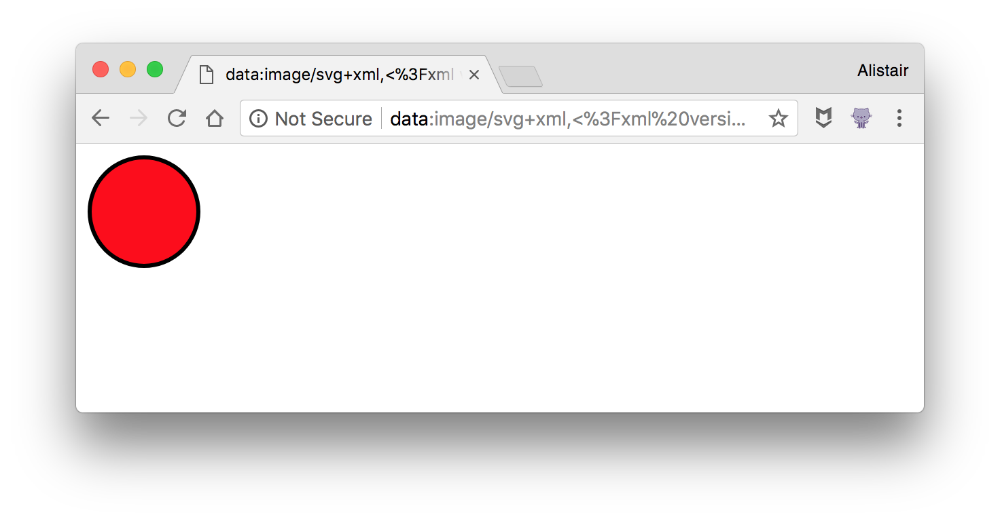

# svg-to-dataurl

> 😹 convert SVGs to DataURLs

[](https://travis-ci.org/F1LT3R/svg-to-dataurl)
[](https://coveralls.io/github/F1LT3R/svg-to-dataurl?branch=master)
[](https://www.npmjs.com/package/svg-to-dataurl)
[](https://github.com/sindresorhus/xo)

## Install

```
$ yarn add svg-to-dataurl
```

## Usage

Where `svgStr` is a string of SVG content, like this:

```xml
<?xml version="1.0" encoding="utf-8"?>
<svg version="1.1" xmlns="http://www.w3.org/2000/svg">
		<circle cx="50" cy="50" r="40" stroke="black" stroke-width="3" fill="red" />
</svg>
```

You can convert the string to a DataURL with `svgToDataURL()`:

```js
const svgToDataURL = require('svg-to-dataurl')
const dataUrl = svgToDataURL(svgStr)

console.log(dataUrl)
// data:image/svg+xml,%3C%3Fxml%20version%3D%221.0%22%20encoding%3D%22utf-8%22%3F%3E%3Csvg%20version%3D%221.1%22%20xmlns%3D%22http%3A%2F%2Fwww.w3.org%2F2000%2Fsvg%22%3E%3Ccircle%20cx%3D%2250%22%20cy%3D%2250%22%20r%3D%2240%22%20stroke%3D%22black%22%20stroke-width%3D%223%22%20fill%3D%22red%22%20%2F%3E%3C%2Fsvg%3E
```

## Visual Confirmation

You can test the string works by pasting the output into the address bar of your web browser:


